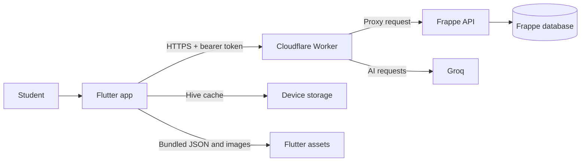

# TapApp

TapApp is a Flutter learning application for shared-device student accounts. A student selects a profile, completes onboarding, watches a lesson video, submits an activity, takes a quiz, and receives XP, gems, streak progress, and achievements.

This documentation covers the complete system implemented in this repository:

- **Flutter app:** screens, Riverpod providers, repositories, local cache, and bundled learning content.
- **Cloudflare Worker:** public API gateway, JWT validation, CORS, rate limiting, Tapbuddy, and AI submission review.
- **Frappe backend:** authentication, profiles, learner progress, achievements, weekly windows, jobs, and DocTypes.

## System at a glance

The Flutter app calls the Worker URL defined in `lib/core/constants/app_constants.dart`. It does not call Frappe or Groq directly.

## Read this first

| Goal                                      | Page                                                |
| ----------------------------------------- | --------------------------------------------------- |
| Run the project locally                   | [Getting Started](getting-started.md)               |
| Understand ownership and data flow        | [Architecture](architecture.md)                     |
| Change screens, providers, or caching     | [Frontend](frontend.md)                             |
| Understand onboarding and classroom rules | [Learning Flows](learning-flows.md)                 |
| Call endpoints from Postman               | [API Reference](api-reference.md)                   |
| Maintain Frappe jobs and DocTypes         | [Frappe Backend](frappe-backend.md)                 |
| Add a course, language, flow, or image    | [Content and Assets](content-and-assets.md)         |
| Release the app and Worker                | [Deployment](deployment.md)                         |
| Test or diagnose production behavior      | [Testing and Operations](testing-and-operations.md) |

## Source of truth

When documentation and code disagree, use this order:

1. Worker routes in `worker/src/routes.js` for the public HTTP contract.
2. Flutter repositories in `lib/data/repositories/` for payloads consumed by the app.
3. Deployed Frappe methods for backend behavior.
4. This documentation.

Update the related page whenever one of those contracts changes.
