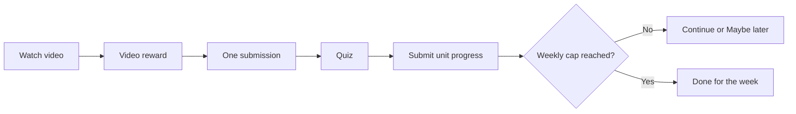

# Learning Flows

## Authentication and profile selection

1. Check whether the phone is registered.
2. Log in with phone and password, or complete the reset-password OTP flow.
3. Store the returned access token securely.
4. Show profiles returned during login or fetch/search additional pages.
5. Select a profile. The response contains full learner state and is cached.
6. Route to onboarding when the profile is incomplete; otherwise route to Home.

## Onboarding

The runtime reads `assets/flows/en/onboarding/student_onboarding.json`. Components are resolved through the onboarding component registry. Completion can update permitted profile fields, enroll a course, and mark onboarding complete through `/onboarding/complete`.

If onboarding JSON is renamed or moved, update both the flow manifest and `pubspec.yaml` asset declarations.

## Unit lifecycle

The app stores each stage locally and sends one progress API request after the whole unit is complete. The request may contain `video_index`, `submission_index`, `quiz_index`, accumulated `xp`, and `activity_type: unit_complete`.

## Submission by archetype

Only one assignment step is shown for a unit.

| Learner archetype     | Submission shown |
| --------------------- | ---------------- |
| `dormant`             | Emoji            |
| `fence_sitter`        | Text or audio    |
| `irregular_submitter` | Image            |
| `submitter`           | Image or video   |

Emoji submissions are evaluated locally. Text, image, and audio submissions may be reviewed through the Worker AI endpoint. Course steps must use matching `sub_types` values.

## Progress indexes

Two indexes have different meanings and must remain separate:

- Top-level learner `submission_index`: lifetime verified submissions, used for archetype and gems.
- Enrollment `submission_index`: completed submission position in the active course, used to resolve the current unit.

Never use the lifetime index to advance a course.

## Continue versus Maybe later

Completing the first unit stores a Home continuation marker. Selecting **Maybe later** returns Home without consuming it. Opening Class again must still show the next-unit choice. Only **Let's go** clears the marker and starts the next unit.

## Weekly limit

The product limit is two completed activities per learner per seven-day window. The frontend compares:

- Frappe's `activities_watched_this_week`, `activities_remaining`, and `is_bingeing`; and
- unique locally completed unit keys for the current window.

The greater completion count wins. This prevents a stale server response from allowing a third activity. If Frappe omits `window_start_date`, the device uses the current Monday as the local cache window key.
