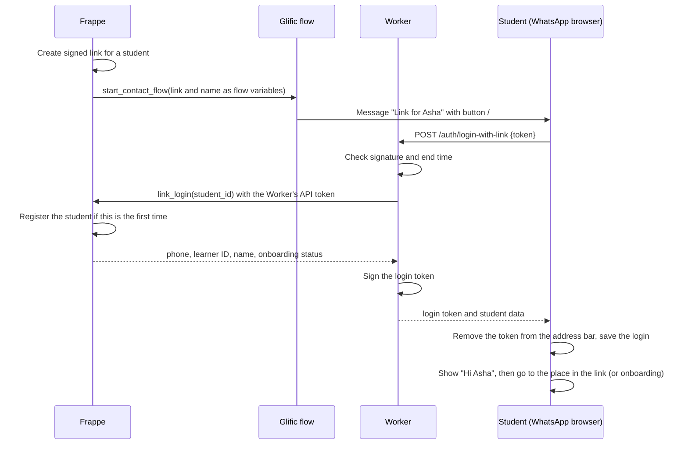
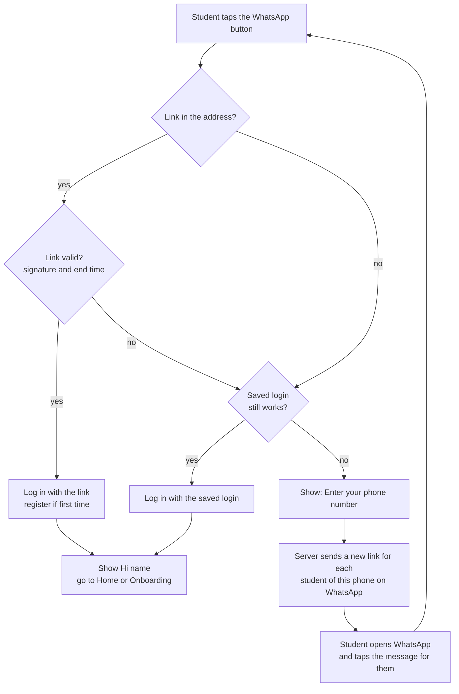
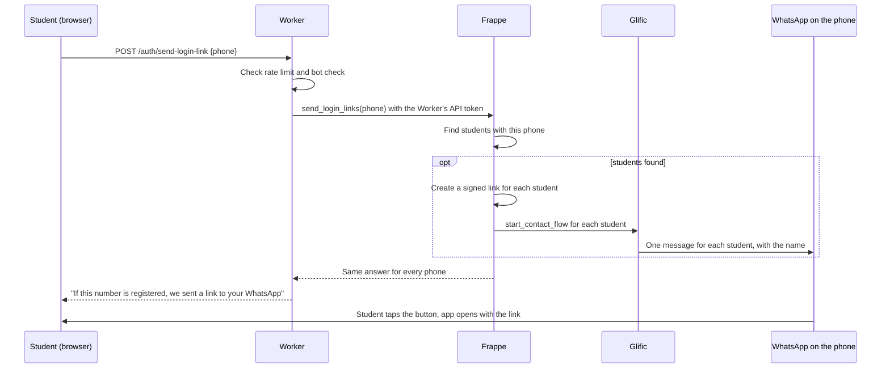

# WhatsApp Link Login (Draft Spec)

**Status:** draft for review. No code has been written yet.

## Context

Today, students use TAP through WhatsApp (with the Glific platform). We want to move students eventually to the TapApp web app and native app. The initial goals are to find gaps, to measure where students stop (drop-offs), and, finally, to stop using WhatsApp completely.

To make the move easy, we add a button to a WhatsApp message. When the student taps it, TapApp opens inside WhatsApp's own browser, and the student is **logged in automatically**. The student does not type a phone number or a password. The first tap also **registers** the student in TapApp.

For now, WhatsApp stays as the channel for **notifications**: reminders, escalations (extra nudges when a student is quiet), and notes that feedback is ready. Each of these messages carries a link that opens the web app. The lessons and the feedback are shown in the web app.

Because WhatsApp will go away later, the link is only a bridge. The design keeps the link creation in one function. A later version can send the link through another channel.

## Words used in this document

| Word | Meaning |
|---|---|
| Glific | The WhatsApp platform TAP uses to talk to students. |
| Template (HSM) | A WhatsApp message that WhatsApp approved in advance. Ours has a button that opens a web address. |
| Worker | Our small server (Cloudflare) between the app and Frappe. It checks tokens and limits requests. |
| Frappe | The main TAP server. It stores students, learners and progress. |
| Student ID | The ID of a student in the existing system. It looks like `ST00000123`. The `Student` record also has the phone and the Glific ID. |
| Learner ID | The ID of a learner in TapApp. It looks like `TL00000123`. It holds XP, streak, weekly limits and enrollments. |
| Glific ID | The ID of a contact in Glific. We believe there is one for each student. |
| Registration | Creating the TapApp records for a student the first time (see "Registration"). |
| Token | A signed text that proves who the user is. |
| Signature (HMAC) | A secret code made from a message and a secret key. Only the servers that know the key can make it. If someone changes the message, the signature no longer fits. |
| Probe | A small test the app runs to find out if the browser keeps its saved data. |
| OTP | One-time password. A short code sent to a phone. |

## How the link works (short version)

1. Frappe creates a **signed link** for one student. The link contains the student ID and an end time.
2. Frappe asks Glific to send a WhatsApp message with the link and the student's name.
3. The student taps the button. TapApp opens.
4. The **Worker** checks the signature and the end time.
5. The Worker asks Frappe for the student's data (and registers the student if this is the first tap).
6. The Worker creates a login token and sends it to the app.
7. The student sees their home screen.

If someone changes the student ID in the link, the signature does not fit, and the Worker refuses the link.

## Decisions already taken

| # | Decision |
|---|---|
| D1 | A valid link logs the student in. There is no password step. |
| D2 | The **Worker** checks the link signature. The app never decides if a link is valid. |
| D3 | The link is for **one student**. It opens that student directly. There is no profile list. Brothers and sisters get their own links. |
| D4 | An expired or invalid link shows **no** student information. |
| D5 | If there is no valid link and no saved login, the app shows a screen to type the phone number. If students are registered with that phone, Frappe sends a new link for each of them on WhatsApp. The screen gives the same answer for every number. |
| D6 | **Design as if every visit from WhatsApp is a fresh browser launch.** We do not trust saved data to stay. |
| D7 | The **server** is the source of truth. The app sends progress to the server after each step. Saved data on the device is only a speed-up. |
| D8 | Lessons are shown in the web app, not in WhatsApp messages. WhatsApp sends notifications (reminders, escalations, "feedback is ready"), and each one carries a **fresh link**. The saved login still helps, because a student may open an old message. The phone-number screen (D5) is the way back in when there is no valid link and no saved login. |
| D9 | We do not use passwords or OTP codes for students. The WhatsApp link is the proof that the student owns the phone. |
| D10 | The Worker creates the login token (it signs it). Frappe already accepts tokens signed with the shared secret. |
| D11 | The link carries a **student ID** (not the phone). The ID has a type in front (for example `st:ST00000123`). Later, the link can carry another kind of ID without a new format. |
| D12 | Every message names the student ("Link for Asha"). When a phone has several children, people can see who the message is for. After login, the first screen says "Hi Asha" and has a "Not you?" button. |
| D13 | The first valid link **registers** the student (see "Registration"). |
| D14 | We log events from the first day, so the client can measure drop-offs (see "Events to log"). |
| D15 | The link can say **where to go** after login (for example the feedback for one submission). The place is inside the signed text, so nobody can change it. The app accepts only places from a fixed list. |
| D16 | One Frappe function creates every link. All notification jobs (content, reminders, escalations, feedback) call it. |
| D17 | Each student has **one learner** in TapApp, and the `student` field in the profile row is always filled. We enforce it with a unique rule on `student`. If Frappe does not allow a unique rule on a child table field, we enforce it in code with a lock. Prototype rows with an empty or repeated `student` are cleaned or deleted before launch. |

## Settings

These are proposed values. Please review them.

| # | Item | Proposed value |
|---|---|---|
| O1 | How long a link works | 7 days. It only has to cover the first login and devices that lose saved data. Keep it as a Frappe setting, so it can change without a new release. |
| O2 | Can a link be used more than once? | Yes, until it expires. WhatsApp can open a link in the background (a link preview) before the student does. A one-time link would be used up by that. |
| O3 | How long the login lasts after using a link | 30 days with sliding refresh. See the explanation below. Keep it as a Frappe setting. |
| O4 | Phone number format | One format everywhere: country code and number, no spaces and no `+` (for example `919876543210`). The primary phone is `Student.phone`. |
| O5 | Limits on the phone-number screen | 1 request per minute and 3 per hour for each phone. 10 per hour for each internet address (IP). A bot check (for example Cloudflare Turnstile) before sending. |
| O6 | Most links sent for one phone in one request | 5. This stops one request from sending many messages. |

### More about O3: login length and refresh

The server gives the app a token. The token has an end date. If the student keeps using the app, the server gives a new token before the old one ends. This is called **refresh**.

- **Today:** a token lasts 90 days. The server refreshes it when **less than 30 days** are left.
- **The rule must fit the token length.** If the threshold is as long as the token, the server refreshes on **every** request.
- **Our rule:** refresh only when **less than half** of the token's life is left. For a 30-day token, that is 15 days.
  - Days 0 to 15: no refresh.
  - Days 15 to 30: the next request gets a new 30-day token.
  - A student who does nothing for 30 days is logged out.
- **Code to change:** `REFRESH_THRESHOLD_SECONDS` in `worker/src/auth.js` (Worker) and `TOKEN_REFRESH_THRESHOLD_DAYS` in `tapapp_auth.py` (Frappe). The code should work out the threshold from each token's own length.
- **On devices that do not keep saved data,** the app cannot keep the token, so the length does not matter. These students need a link or the phone-number screen on each visit. They cost the most messages, so we log how often this happens.
- **Before launch:** with a 30-day login, we must be able to cancel tokens (known gap S8).

## The link

WhatsApp lets us put **one variable at the end** of a button web address. TapApp uses `#` in its web addresses, so the template address is:

```
https://<app-host>/#/l/
```

The variable `{{1}}` is one token:

```
<payload>.<signature>
payload   = base64url("v1|st|<student_id>|<exp>|<dest>|<kid>")
signature = base64url(HMAC-SHA256(secret[kid], "v1|st|<student_id>|<exp>|<dest>"))
```

- `st` is the type of the ID (a student ID).
- `exp` is the end time of the link (Unix time, in seconds). It is inside the signed text, so nobody can change it.
- `dest` is the place to open after login. Examples: `home`, `class`, `feedback:<submission_id>`. It is inside the signed text too. The app accepts only places from a fixed list, and only places inside the app. If `dest` is empty or unknown, the app opens `home`.
- `kid` is the key ID. It lets us change the secret key later without breaking all links.
- The secret key is not the same as the login-token secret. It is stored in two places: in Frappe (the `Secrets` doctype, for example `tapapp_link_secret`) and in the Worker (a Wrangler secret, `LINK_SECRET`). Frappe uses it to create links. The Worker uses it to check them.
- The Worker compares signatures in a way that does not leak timing information (constant-time compare).
- The part after `#` is not sent to the server. So the token does not appear in server logs.

## How Frappe trusts the Worker

The Worker checks the link, then asks Frappe for the student's data. If Frappe answered anyone who asked, a stranger could call it with any student ID.

Many existing Frappe endpoints that Glific calls are open (`allow_guest=True`) and have no secret check. We do **not** copy that pattern. See known gap S13.

We use Frappe's built-in API token for a service user:

- Create a Frappe user for the Worker, with its own role. Create an API key and secret for it.
- The Worker sends `Authorization: token <key>:<secret>` on these calls. (The app's own token travels in a different header, `X-Flutter-Authorization`.)
- The new methods (`link_login`, `send_login_links`) are normal `@frappe.whitelist()` methods, **not** `allow_guest`. They check the role with `frappe.only_for(...)`.
- Frappe stores the secret encrypted and does the check. We write no custom check code.
- The key and secret are Wrangler secrets in the Worker (`FRAPPE_API_KEY`, `FRAPPE_API_SECRET`). These names are already in the deployment notes.
- This also helps with known gap S3 for these methods.
- An IP allow-list for the Worker is not a good fix. Cloudflare Workers call from Cloudflare's shared address ranges, which other Workers use too. The API token is the real protection.
- To confirm: how `callBackend` in `routes.js` sets the `Authorization` header today.

## Registration

The first valid link for a student creates the TapApp records. It is done in Frappe, in one method (`link_login`), called by the Worker.

1. Find the student by the student ID. If there is none, refuse.
2. Find the phone's `Tapapp Auth` record. If there is none, create it from `Student.phone`.
3. Find the profile row that has this student. If there is none, create the `Tapapp Learner` and the profile row (with the `student` field set). Copy the starting data from the student (open question Q2).
4. Return the phone, the learner ID, the name, and whether onboarding is finished.

Rules:
- It must be **get or create**: a second tap, or two taps at the same time, must not create two learners. D17 says how: a unique rule on the `student` field (or a lock in code, if Frappe does not allow a unique rule on a child table field). Frappe must catch the error from the second tap and use the first learner. Before launch, clean or delete prototype rows with an empty or repeated `student`.
- Brothers and sisters share a phone. The first child's link creates the `Tapapp Auth` record. The second child's link only adds a profile row.
- A link preview should not register anyone. The token is after `#`, which is not sent to the server, and preview tools do not run the app. We should test this.

## Login token

The Worker signs the token with the shared token secret. It has the same claims as today (`phone`, `type: access`, `iat`, `exp`, `jti`), plus two new ones: `sid` (student ID) and `lid` (learner ID). Frappe ignores claims it does not know, so it still accepts the token. Frappe still checks that `phone` matches the request. Later releases can move the checks from `phone` to `lid`, and then drop `phone`.

## What we assume about saved data on the device

Because of D6, the app must work when the device keeps nothing between visits.

- **Test, do not guess (the "probe").** On the first visit, the app saves a small note in the browser. On the next visit, the app checks if the note is still there.
  - If the note is there, the browser keeps our saved data. The app can use the saved login.
  - If the note is missing, the app does not trust saved data. It uses a link or the phone-number screen.
  - On the very first visit the app cannot know yet, so it assumes the data may be lost.
- **Do not use these browser checks.** `navigator.storage.persisted()` was `false` in every test. `navigator.storage.estimate()` showed zero usage even when data existed.
- **User agent is a hint only.** WhatsApp on Android adds `WA4A/<version>` to its user agent. We can use it as a hint. We should not depend on it alone.
- **Source tag.** When the app opens from a link, it records `src=wa` for the events. This tells us the visit came from the WhatsApp button.
- **One setting in the app.** `StoragePolicy.persistent` or `StoragePolicy.ephemeral`. If we later stop using the WhatsApp browser, the probe changes the setting by itself. No code change is needed.
- **The server comes first in both cases:**
  - Send progress to the server after each video, submission and quiz step. Do not wait for the end of the unit. We must check that the Frappe method `submit_progress` allows this (see `learner.py`).
  - The weekly limit must be kept and checked on the server.
  - Saved AI reviews and saved TapBuddy chat are optional. If they are lost, nothing should break.
  - Keep the login token only if the probe shows that saved data stays.

### Test results: WhatsApp browser

Tool used: `web/storage-probe.html`. This is a temporary page. Delete it after testing.

| Device | Time since first visit | localStorage | IndexedDB | Cookie | Cache API | sessionStorage | HTTP cache |
|---|---|---|---|---|---|---|---|
| Samsung SM-G781B, Android 13, WhatsApp 2.26.38.73 | about 2.5 minutes (browser closed and reopened) | kept | kept | kept | kept | lost | used (0 bytes) |
| Same phone | about 4 minutes (WhatsApp force-closed) | kept | kept | kept | kept | lost | used (0 bytes) |
| Same phone | about 22 hours | kept | kept | kept | kept | lost | checked with server (300 bytes) |
| Second Samsung phone (model and details not recorded) | not recorded | kept | kept | kept | kept | not recorded | not recorded |

Other things we saw:

- WhatsApp adds `?fbclid=...` (about 150 characters) to the web address. The login token must go **after the `#`**, not in the part after `?`.
- The referrer is empty.
- `sessionStorage` is lost on every visit. Do not use it for the login.

**Not tested yet (no device):** iPhone, and other Android makers such as Xiaomi and Oppo. Both Android results are from Samsung. Treat iPhone and other makers as unknown and check them in the pilot.

**Also not tested:** more than one day, the `#/l/{{1}}` ending on the button, and the size of the real Flutter app on first load.

**Default for now:** use the probe. On the tested phones it says "persistent". Keep D6 and D7 to be safe.

## Flows

### Valid link



### What the app does when it opens

The app decides in this order:

1. **Valid link** → log in with it.
2. **Expired or missing link, and a saved login that still works** → log in with the saved login.
3. **Otherwise** → show the screen "Enter your phone number".

Other rules:
- A link with a **wrong signature** (not just expired) is treated as a missing link.
- The server never shows names, profile counts, or "account exists" before login (D4).
- If the link is for a different student than the saved login, the app first sends any unsent progress of the old student to the server (best effort). Then it **switches** the saved login and the active profile to the new student.
  - If the phone is the same (brothers and sisters), it keeps the saved data of each child. Most saved data is stored for each learner ID, so it does not mix. Do **not** call `clearAll`, because that deletes the other child's unsent progress.
  - If the phone is different, the app calls `clearAll` after sending the unsent progress.
- On every login by link, the app refreshes the learner state from the server. The saved state has no expiry, so it can be old (for example, progress made on another device or on WhatsApp).
- One login slot per browser: the token, the phone, the active profile and the language setting are single values. Only one student is logged in at a time.



### The phone-number screen

The student types the phone number. The server finds the students with this phone (`Student.phone`). It sends one message for each student, with the student's name in it (up to the limit O6). The screen always says: "If this number is registered, we sent a link to your WhatsApp." The text and the response time are the same for every number.



## Events to log (D14)

Log each event with the student ID (or learner ID), the time, and `src` where it makes sense. The client can then see where students stop.

Use the existing structured logging in Frappe (`emit` in `tap_lms/monitoring.py`). It writes JSON logs that go to Cloud Logging. Glific logs already go to BigQuery, and the two can be joined on `student_id` or `glific_id`. Log the student ID, **not** the phone number.

- Link created, message sent, message delivered or failed (with the kind of message: login, content, reminder, escalation, feedback ready)
- Link opened (valid, expired, or wrong signature)
- Registration done (first time)
- Login by link, login by saved login
- Phone-number screen shown, link requested, request refused by a limit
- "Not you?" tapped
- First lesson started, first unit completed
- Probe result (saved data kept or not), and the device type from the user agent

## Progress between WhatsApp and the app

The client wants students to switch between WhatsApp and the app without losing progress. This is the hardest part, and we have not decided it.

Today there are two separate places for progress:
- **WhatsApp system:** `ProgramEnrollment` (a state machine driven by a job every minute), submissions, quizzes, and so on. Points, streaks and gems are copied to Glific contact fields.
- **TapApp:** `Tapapp Learner`, with its own XP, streak, gems, enrollments and weekly counters.

We have not compared the two in detail.

**Submissions and feedback.** The prototype sends text and images to an AI model (Groq) through the Worker. This will **not** be carried forward. TapApp will use the existing pipeline: `save_submission`, then plagiarism check, then AI feedback. WhatsApp will send a note that feedback is ready, with a link (D15). How the existing pipeline works today (from the system documentation):
- `save_submission` needs an **active `ProgramEnrollment`** for the student. So a student must be enrolled in the Summer Program state machine to submit work.
- After the AI feedback is ready, `feedback_consumer` sends a WhatsApp notification. The student then asks for the feedback, and Glific calls `ready_to_receive_feedback` and `get_submission_feedback`. The answer has `status`, `overall_feedback` and `audio_feedback_url`.
- Quizzes run on the server: `start_quiz` and `submit_answer` (one call per question). The server measures the time for each answer. The prototype app runs quizzes on the device.

For the app, these Glific-facing endpoints need versions that the Worker can call safely (see "How Frappe trusts the Worker"). How feedback and notifications work in detail is still to be decided.

### Option A: one place for progress

TapApp reads and writes the same records that WhatsApp uses.

- Good: real switching. There is one truth.
- Good: submissions already use the existing pipeline, so this part is mostly done.
- Bad: points, streaks, weekly limits and quizzes must follow the same rules in both systems. This changes much of the TapApp backend that exists today.
- Open: do the two systems use the same rules (units, streaks, weekly limits)?

### Option B: one side at a time (proposed for the pilot)

Each student has a "home" channel: WhatsApp or the app. Only one side is active for a student at a time.

- When a student moves to the app, we copy their progress **once**, from the old system to TapApp (during registration). After that, the app is the home channel.
- Switching back to WhatsApp is a manual step. It is not automatic.
- Good: simple. Fits the plan to move students slowly. Gives data for the client.
- Bad: not seamless. A student who goes back to WhatsApp may not see the progress made in the app.
- Rule needed: for a student whose home channel is the app, the old jobs must not send lesson content. They still send notifications (reminders, escalations, feedback ready) with a link (D8).
- Where the link goes in the existing code: the `content_delivery`, `escalation` and `feedback_notification` handlers of `pe_dispatcher`, and the Glific notification in `feedback_consumer`. `parent_call` escalations are phone calls and carry no link.

### Decision needed

Please ask the client what "seamless" means. We propose B for the pilot. After the pilot, we decide if we need A.

## What must be built or changed

### Frappe (`tap_lms/tapapp/api/auth/`)

| Method | Who can call it | Purpose |
|---|---|---|
| `make_webapp_link(student, dest)` (internal, not a web method) | Called by Frappe code only | Creates the signed link (D16). The notification jobs call it (content delivery, reminders, escalations, feedback ready). It does not send anything. |
| `send_link_to_student(student, dest)` (internal, not a web method) | Called by Frappe code only (a job, an event, or `send_login_links`) | Calls `make_webapp_link`. Finds the Glific contact (`Student.glific_id`). Starts the Glific flow with `start_contact_flow`, passing the link and the name in `default_results`. A later version can change the channel here. |
| `link_login(student_id)` | Only the Worker's service user (API token, role check) | Registers the student if needed. Returns the phone, learner ID, name and onboarding status. |
| `send_login_links(phone)` | Only the Worker's service user (API token, role check) | Finds students with this phone. Calls `send_link_to_student` for each, up to O6. Gives the same answer and takes the same time for every phone. Logs every send and every failure. |
| `check_phone`, `login_with_password`, `forgot_password_*`, `reset_password` | Anyone (guest) | Not used for students (D9). Lock or remove them so they cannot be called. This closes known gaps S1, S2 and S4. If teachers use passwords, keep that path separate. |

### Worker

- Add two routes in `routes.js`: `/auth/login-with-link` and `/auth/send-login-link`. Both use `auth: false`.
- `/auth/login-with-link`: check the link, call `link_login`, sign the token, return the data.
- `/auth/send-login-link`: bot check, then call `send_login_links`.
- Add a rate-limit group for `/auth/send-login-link` in `ratelimit.js` (O5).
- For every call that is about a student (submissions, quizzes, progress), the Worker sets `student_id` from the login token (`sid`) and ignores any ID sent by the app. This stops a user from acting as another student. It also keeps wrong IDs out of the pipeline, where a bad ID can leave a stuck message in RabbitMQ.
- Add the secrets: `LINK_SECRET` (to check links), and `FRAPPE_API_KEY` and `FRAPPE_API_SECRET` (to call Frappe as the service user).
- Change the token refresh threshold (see O3).

### Flutter app

- Add a route `/l/:token` in `router.dart`. It must run **before** the login check.
- Add the "Enter your phone number" screen and the "we sent a link" message.
- After login with the link, call `history.replaceState` to remove the token from the address bar.
- Go straight to the student's home screen (or onboarding). Show "Hi <name>" with a "Not you?" button.
- Add the new texts in all languages (en, hi, kn, mr).
- Add the storage probe and the `StoragePolicy` setting.
- Send the events listed above.

### Glific

- One flow that Frappe starts for one contact. It reads the link and the name from the flow variables and sends the template message. Frappe uses this same flow for the first message to a student and for the phone-number screen.
- Glific does not call Frappe for this feature.
- Templates with the name in the text and a dynamic-address button. WhatsApp must approve each template. We may need one for each kind of message (login link, feedback ready, reminder, escalation).
- For messages sent to a whole group, the link is different for each student. Two ways: Frappe starts a flow for each student, or Frappe writes the link into a Glific contact field (for example `webapp_link`) and the group flow uses it. The second way matches how Frappe already copies points and streaks into contact fields. At large size (about 100,000 students) the first way needs a queue and batches. Glific's limits have not been checked. A link in a contact field must be refreshed before it expires (O1).

## Open questions

| # | Question |
|---|---|
| Q1 | Progress between WhatsApp and the app: option A or B? |
| Q2 | Which `Student` fields are copied into `Tapapp Learner` at registration (name, grade, school, language, district, state, and so on)? |
| Q3 | Does Glific allow two contacts with the same phone number? We believe one Glific ID belongs to one student. |
| Q4 | Can a Glific template put a flow variable (the link) into its button address, and a second variable (the name) in the text? Our test flow suggests yes for the link. |
| Q5 | Where will the Frappe `tapapp` code live? The plan is `DalgoT4D/frappe_tap`. |
| Q6 | Who creates the old-system records (`Student`) for students who join later without WhatsApp? |
| Q7 | Do the school or shared-device flows (a teacher's phone with a class roster and a password) stay next to the parent flow? The code has `teacher`, `admin_code`, roster and bulk-update parts. If yes, the phone-number screen must apply only to parent phones. |
| Q8 | `save_submission` needs an active `ProgramEnrollment`. Are all students who will use the app enrolled in the Summer Program? If not, how do other students submit work and get notifications? |
| Q9 | Feedback and notifications: what exactly is sent, and when? The plan is a WhatsApp note with a link. |
| Q10 | TapBuddy is the AI chat helper in the prototype. Students ask questions in a chat panel, and the Worker sends them to an AI model (Groq). Does it stay in the product, or is it replaced by `tap_ai`? |

## Risks and things to test first

1. **Browser storage.** D6 says assume nothing is kept. Still, test on Android and iPhone to learn what is kept, and measure how much the app downloads on first load (known gap P3).
2. **Deep link with `#`.** Check that `/#/l/<token>` reaches the app's router inside the WhatsApp browser, through Firebase hosting.
3. **Shared links.** Anyone who has a valid link can log in until it expires. We accept this in D1 and limit it with O1.
   - A test showed that the template message **cannot be forwarded**. The only way to share is: "Open in browser" in the WhatsApp menu, copy the address from Chrome, and paste it into a message. This takes several deliberate steps.
   - Still to check: the real production template behaves the same, iPhone behaves the same, and the button has no "copy link" option.
4. **"Open in browser" path.** The token stays in Chrome's address bar. It may also stay in Chrome history, and in synced history if the user is signed in to Chrome.
   - `history.replaceState` clears the address bar after login. We have **not** tested if Chrome history keeps the original address.
   - Also test that login by link works in Chrome, which starts with empty saved data.
5. **Cost and abuse.** WhatsApp bills every template message. On the phone-number screen, anyone can type any number, so a stranger could trigger many messages to parents. A phone with several children costs several messages. The limits, the cap (O6) and the bot check (O5) are required.
6. **Delivery.** If WhatsApp cannot deliver the message, the student sees nothing. Log delivery failures in Frappe. Check with the client if free-form messages within 24 hours of the student's last message are free for the Glific plan. We have not verified this.
7. **Long sessions on shared phones.** A 30-day login on a family phone stays open for anyone who picks it up. Add a visible "Log out" and the ability to cancel tokens (S8) before launch.
8. **Two systems at the same time.** Until the progress question (Q1) is decided, a student who uses both WhatsApp and the app can see different progress in each.
9. **Teacher and class phones.** A teacher's phone may have a roster of up to 200 students. If a stranger types it on the phone-number screen, one message per student could go to the teacher. The cap (O6) limits this, but the message count and the cost are still wrong. Decide Q7 first.
10. **Many messages with links.** Notifications will send a link in each message. At large size the cost and the load on Glific grow. See the Glific section.
11. **Secrets and the encryption key.** Frappe encrypts stored secrets (such as `tapapp_jwt_secret`, the future `tapapp_link_secret` and API secrets) with the site's encryption key. If the site is restored on a new server without that key, the secrets become unreadable and calls fail silently (see `docs/server_setup.md`, section 7a). Back up the key. If a secret is lost, all links and tokens stop working. The `kid` field lets us move to a new key.
12. **Two children on one device.** Saved data is stored for each learner, but the login, the active profile and the language are single values. Test: child A, then child B, then child A again. Check that A's unsent progress is kept and sent, A's state is refreshed, and the language is right for each child. Check if the language is a setting of the child or of the browser.
13. **Registration bugs.** A wrong "get or create" can make two learners for one student, or attach a learner to the wrong phone. Test it with brothers and sisters, double taps, and students with no `glific_id`. The setup guide lists `SerializationFailure: could not serialize access` errors from concurrent writes (for example with `pe_dispatcher`). Registration must catch this error and retry.

## Test plan (outline)

- **Worker:** valid, expired, changed and wrong-key links. A changed student ID or end time. Token claims. Tests for the new routes and the rate-limit group.
- **Frappe:** `link_login` with and without the Worker key. First registration and repeat registration. Brothers and sisters on one phone. Same answer and similar time for known and unknown phones in `send_login_links`.
- **Flutter:** router tests for the link route, the saved-login fallback, and the phone-number screen. Add them to the existing tests in `test/`.
- **Local test setup:** the Frappe repo has a local Docker setup (`docker-compose.local.yml`) with a Glific stub, so `start_contact_flow` can be tested without sending real messages.
- **Manual:** the full path in WhatsApp on Android and iPhone.

## Proposed order of work

1. Answer the open questions that block work: Q2, Q3, Q4 and Q5. Confirm the settings O1 to O6.
2. Check progress saving (D7): read Frappe `learner.py`. Then change the app to send progress after each step, and to read the weekly limit from the server.
3. Worker: link check, token signing, new routes, rate-limit group.
4. Frappe: signing functions, `send_link_to_student`, `link_login`, `send_login_links`, and tests. (Wait until the intern's work is merged.)
5. Flutter: link route, "Hi name" screen, phone-number screen, events.
6. At the same time: test the WhatsApp browser with a throw-away link (iPhone and other Android makers).
7. Glific: the flow and the template.
8. Lock or remove the password and OTP methods for students. See [known gaps](known-gaps.md), items S1, S2 and S4.
9. Decide the progress option (Q1) with the client.
