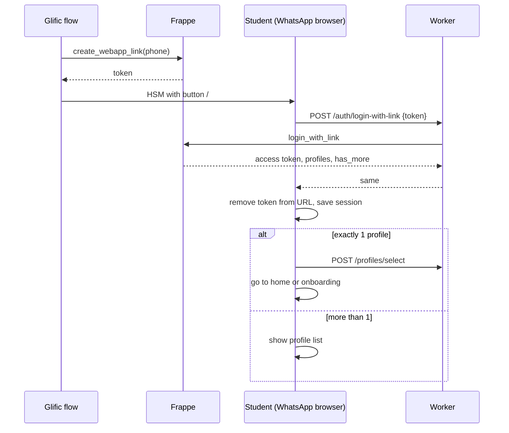

# WhatsApp Link Login (Draft Spec)

**Status:** draft for review. No code has been written.

## Goal

Students already talk to the system on WhatsApp (Glific/Gupshup). We want a button in a WhatsApp template message (HSM) that opens TapApp in WhatsApp's in-app browser and **logs the student in without typing a phone number or a password**. A link with the phone number alone can be forged, so the link is signed.

## Decisions taken

| # | Decision |
|---|---|
| D1 | A valid link logs the student in. No password step. |
| D2 | The server checks the signature. The app never decides if a link is valid. |
| D3 | One profile on the phone → go straight to the home screen (or onboarding if not finished). Several profiles → show the profile list. |
| D4 | An expired or invalid link shows **no** student information. |
| D5 | An expired link offers two options: send a new link to WhatsApp, or enter the phone number manually. |
| D6 | **Every visit from a WhatsApp button is a fresh browser launch.** Browser storage (token, cache) cannot be trusted between visits. |
| D7 | The server is the only source of truth. Progress is sent to the server after each step. The local cache is only a speed-up. |
| D8 | Each lesson message from Glific carries its **own fresh link**. The resend option is the backup, not the normal path. |

## Defaults to confirm (open)

| # | Item | Proposed default |
|---|---|---|
| O1 | Link lifetime | 24 hours (was 30 minutes; longer now because each visit needs a valid link, see D6) |
| O2 | Single-use or reusable | Reusable until it expires. WhatsApp link-preview bots can open a URL before the student does, which would use up a single-use link. |
| O3 | Lifetime of the session created by a link | 24 hours, because the session may not survive the visit anyway (D6). Longer sessions only help if the storage probe shows persistence. |
| O4 | Names on the profile list after a valid link | Full names, as today |
| O5 | How long after expiry a link can still request a new link | 24 hours |
| O6 | Manual phone login | Real OTP sent through Glific, see [S1 and S2](known-gaps.md) |
| O7 | Phone number format | One normalized format (E.164, for example `919876543210`) in Glific, in Frappe, and in the signed text |
| O8 | Resend limit | 3 per hour per phone, 10 per hour per IP |

## Storage assumption

Under D6 the app must work when storage is empty on every launch.

- **Probe first, user agent second.** At startup the app writes a marker to storage. If the marker is found on a later launch, storage persists. Until then, assume it does not. `navigator.storage.persisted()` returned `false` in every test, so it is not a useful signal. The user agent of WhatsApp on Android ends with `WA4A/<version>`, which can be an extra hint. Do not base decisions on it alone.
- **Source tag.** Links carry `src=wa` inside the signed token. This tells us the visit came from the button.
- **One setting.** `StoragePolicy.persistent` or `.ephemeral`. If we later stop using the embedded browser, the probe switches the app to `persistent` without code changes.
- **Server first in both modes:**
  - Send progress to the server after each video, submission and quiz step, not only at unit completion. The Frappe `submit_progress` method must accept this (to be checked in `learner.py`).
  - The weekly limit must be enforced and read from the server.
  - Saved AI reviews and TapBuddy chat history are optional local extras. Losing them must not break anything.
  - Do not keep the session token for later unless the probe shows persistence.

### Test results: WhatsApp in-app browser

Tool: `web/storage-probe.html` (temporary page, delete after testing).

| Device | Gap since first visit | localStorage | IndexedDB | Cookie | Cache API | sessionStorage | HTTP cache |
|---|---|---|---|---|---|---|---|
| Samsung SM-G781B, Android 13, WhatsApp 2.26.38.73 | about 2.5 min (close and reopen) | kept | kept | kept | kept | lost | hit (0 bytes) |
| same | about 4 min (WhatsApp force-closed) | kept | kept | kept | kept | lost | hit (0 bytes) |
| same | about 22 hours | kept | kept | kept | kept | lost | revalidated (300 bytes) |
| Second Samsung phone (model and details not recorded) | not recorded | kept | kept | kept | kept | not recorded | not recorded |

Other observations:

- WhatsApp adds `?fbclid=...` (about 150 characters) to the URL. The login token must go after the `#`, not in the query string.
- The referrer is empty.
- `navigator.storage.persisted()` is `false` and `estimate()` reports usage 0 even when data exists. Do not use them.
- `sessionStorage` is lost on every visit. Do not use it for the session.

**Not yet tested (no device available):** iPhone, other Android makers (for example Xiaomi, Oppo). Both Android results so far are Samsung. Treat iOS and other makers as unknown and check them during a pilot. Also not tested: more than one day, the `#/l/{{1}}` suffix, and the size of the real Flutter build on first load.

**Default until more devices are tested:** use the probe. On this phone it reports `persistent`. Keep D6 and D7 for safety.

## Link format

WhatsApp allows one variable at the **end** of a button URL. TapApp uses hash URLs, so the template base URL is:

```
https://<app-host>/#/l/
```

and the variable `{{1}}` is one token:

```
<payload>.<signature>
payload   = base64url("v1|<phone>|<exp>|<kid>")
signature = base64url(HMAC-SHA256(secret[kid], "v1|<phone>|<exp>"))
```

- `exp` is a Unix time in seconds and is inside the signed text, so it cannot be edited.
- `kid` is the key ID. It allows key rotation.
- The secret is stored in the Frappe `Secrets` doctype (for example `tapapp_link_secret`). It is **not** the JWT secret.
- The check uses a constant-time compare.
- The part after `#` is not sent to the server, so it does not appear in server logs or referrer headers.

## Flows

### Valid link



### Expired or invalid link

1. The server answers with a generic error. It returns no names and no profile count.
2. The app shows: "Your link has expired. Get a new link on WhatsApp, or enter your phone number."
3. **Send a new link**: the app sends the old token to `request_new_link`. The server accepts it only if the signature is valid and the link expired less than O5 ago. It then asks Glific to send a new message. The answer is always the same, so nothing leaks.
4. **Enter phone number**: the manual path (O6). The server looks up the phone only after the student enters it.
5. An invalid signature (not just expired) gets no resend option.

### Already logged in

If a link is for a different phone than the saved session, the app signs out (`clearAll`) and then logs in with the link.

## New and changed pieces

### Frappe (`tap_lms/tapapp/api/auth/`)

| Method | Access | Purpose |
|---|---|---|
| `create_webapp_link(phone)` | Glific only (same API-key method as other Glific endpoints, to be checked) | Builds and signs the token. Returns it. |
| `login_with_link(token)` | guest | Checks signature and expiry. Returns the same payload as `_login_payload`, plus `profile_count`. |
| `request_new_link(token)` | guest | Checks the rules in the flow above and triggers a Glific flow. Same answer every time. |
| `forgot_password_send_otp` / `verify_otp` | guest | Replace the fixed `000000` with a random OTP sent through Glific (O6). |
| `check_phone`, `login_with_password` | guest | Stop leaking account status. Stop setting a password on first login. |

### Worker

- New routes in `routes.js`: `/auth/login-with-link`, `/auth/request-new-link` (both `auth: false`).
- New rate-limit bucket for these two routes in `ratelimit.js` (O8).

### Flutter app

- New route for `/l/:token` in `router.dart`, handled before the login check.
- New "link expired" screen with the two options.
- After the exchange, call `history.replaceState` to remove the token from the address bar.
- Skip `profile-select` when the response has exactly one profile and `profiles_has_more` is false.
- Add localized texts for the new screen (en, hi, kn, mr).

### Glific

- A flow that calls `create_webapp_link` and puts the result in the template variable.
- A flow that Frappe can trigger to send a new link.
- A new HSM template with a dynamic-URL button, approved by WhatsApp.

## Risks and things to test first

1. **In-app browser storage.** D6 says assume nothing is kept. Still test on Android and iOS to learn what is kept, and to measure the first-load download size (P3).
2. **Hash URL deep link.** Confirm that `/#/l/<token>` reaches the router in the WhatsApp browser, through Firebase hosting.
3. **Shared links.** Anyone holding a valid link can log in until it expires. This is accepted in D1 and limited by O1. An intern checked that the template message cannot be forwarded. The only way to share is "Open in browser" in the in-app menu, then copying the URL from Chrome and pasting it into a message. This is a deliberate, multi-step action. To confirm: the same behavior with the real production template, on iPhone, and that the button has no "copy link" option. The link lifetime must be a configuration value, not a constant in code.
4. **"Open in browser" path.** The token stays in Chrome's address bar and possibly in Chrome history (and in synced history if signed in). Removing it with `history.replaceState` after login clears the address bar. Whether the history database keeps the original URL is untested. Also test that login by link works in Chrome, with its own empty storage.
4. **Cost.** Each HSM message is billed. The resend limits (O8) protect against abuse.

## Test plan (outline)

- Frappe: valid, expired, tampered and wrong-key tokens. Changed phone or expiry. Resend limits. Same response for known and unknown phones.
- Worker: route and rate-limit bucket tests.
- Flutter: router tests for the one-profile and many-profile cases, and the expired screen. Extend the existing tests in `test/`.
- Manual: the full path on Android and iOS WhatsApp.

## Proposed order of work

1. Confirm the open defaults (O1–O8) and where the Frappe `tapapp` code will live.
1a. Server-first progress (D7): read Frappe `learner.py`, then change the app to send progress after each step and read the weekly limit from the server.
2. Frappe: signing helpers, `create_webapp_link`, `login_with_link`, tests.
3. Worker: routes and rate-limit bucket.
4. Flutter: link route, auto profile selection, expired screen.
5. In parallel: test the WhatsApp in-app browser with a throwaway link.
6. Frappe and Glific: `request_new_link` and the resend flow.
7. Fix S1, S2 and S4 from [Known gaps](known-gaps.md) for the manual path.
