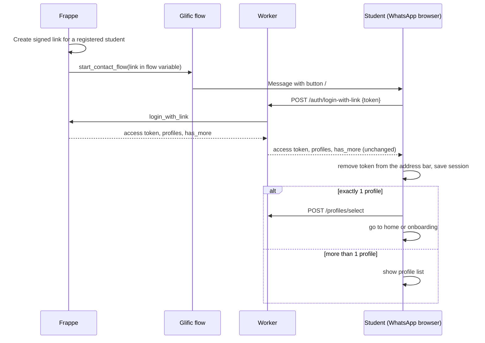
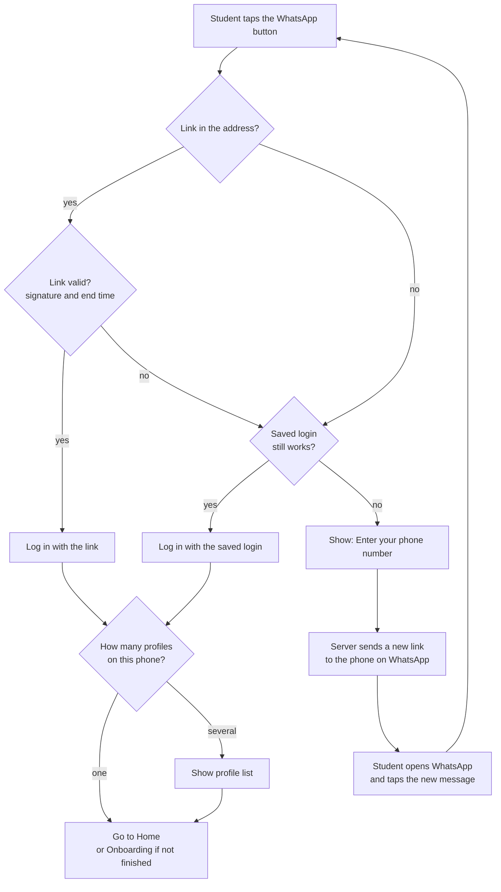
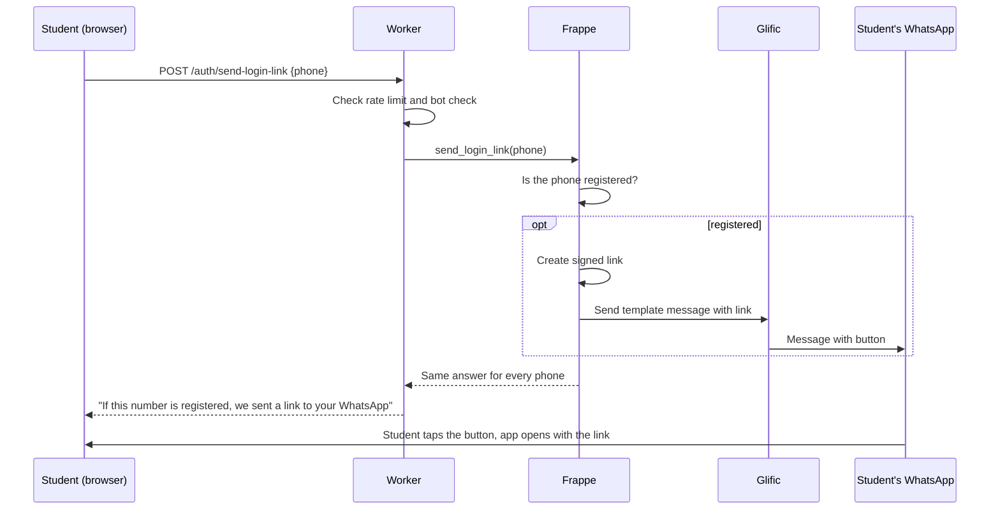

# WhatsApp Link Login (Draft Spec)

**Status:** draft for review. No code has been written yet.

## Goal

Students already talk to the TAP system on WhatsApp (through Glific). We want to add a button to a WhatsApp message. When the student taps it, TapApp opens inside WhatsApp's own browser, and the student is **logged in automatically**. They do not type a phone number or a password.

If the link only contained the phone number, anyone could change the number and enter another student's account. So the link is **signed**. A signature is a secret code that only our server can create. If someone changes the link, the signature no longer matches and the server refuses it.

## Words used in this document

| Word | Meaning |
|---|---|
| Glific | The WhatsApp platform TAP uses to talk to students. |
| HSM / template | A pre-approved WhatsApp message. Ours has a button that opens a web address. |
| Worker | Our small server (Cloudflare) between the app and Frappe. It checks tokens and limits requests. |
| Frappe | The main TAP server. It stores students, profiles and progress. |
| Profile | One student. A phone number can have several profiles (for example, brothers and sisters). |
| Token | A signed text that proves who the user is. |
| HMAC | A way to create a signature from a message and a secret key. |
| Probe | A small test the app runs to find out if the browser keeps its saved data. |
| Ephemeral / persistent | Ephemeral = saved data disappears after a visit. Persistent = saved data stays. |
| OTP | One-time password. A short code sent to the phone. |

## Decisions already taken

| # | Decision |
|---|---|
| D1 | A valid link logs the student in. There is no password step. |
| D2 | The server checks the signature. The app never decides if a link is valid. |
| D3 | If the phone has **one** profile, go straight to the home screen (or to onboarding if it is not finished). If it has **several**, show the profile list. |
| D4 | An expired or invalid link shows **no** student information. |
| D5 | If there is no valid link and no saved login, the app shows a screen to type the phone number. If the number belongs to a registered user, the server sends a new login link to that phone on WhatsApp. The screen gives the same answer for every number. |
| D6 | **Design as if every visit from WhatsApp is a fresh browser launch.** We do not trust saved data to stay. |
| D7 | The **server** is the source of truth. The app sends progress to the server after each step. Saved data on the device is only a speed-up. |
| D8 | Lessons are shown in the web app, not in WhatsApp messages. We send few WhatsApp messages to keep the cost low. A student may have only one old message with a link. So the saved login must last long, and the phone-number screen (D5) is the way back in. |
| D9 | We do not use passwords or OTP codes for students. The WhatsApp link is the proof that the student owns the phone. |

## Settings still to confirm

These are my proposed values. Please review them.

| # | Item | Proposed value |
|---|---|---|
| O1 | How long a link works | 7 days (proposed, to confirm). It only has to cover the first login and devices that lose saved data. Keep it as a Frappe setting, so it can change without a new release. |
| O2 | Can a link be used more than once? | Yes, until it expires. WhatsApp can open a link in the background (a link preview) before the student does. A one-time link would be used up by that. |
| O3 | How long the login lasts after using a link | 30 days with sliding refresh (proposed, to confirm). See the explanation below. Keep it as a Frappe setting, so it can change without a new release. |
| O4 | Names shown on the profile list | Full names, as today. |
| O5 | Phone number format | One format everywhere: country code and number, no spaces or `+` (for example `919876543210`). Use it in Glific, in Frappe and inside the signed link. |
| O6 | Limit on "send me a link" | 1 per minute and 3 per hour for each phone. 10 per hour for each internet address (IP). Plus a bot check (for example Cloudflare Turnstile) before sending. |

### More about O3: login length and refresh

The server gives the app a token. The token has an end date. If the student keeps using the app, the server gives a new token before the old one ends. This is called **refresh**.

- **Today:** a token lasts 90 days. The server refreshes it when **less than 30 days** are left.
- **Refresh only when little of the token's life is left.** We use half of its length. Example: a 30-day token is refreshed only in its last 15 days. If the threshold were as long as the token, the server would refresh on **every** request.
- **The fix:** refresh only when **less than half** of the token's life is left. For a 30-day token, that is 15 days.
  - Days 0 to 15: no refresh.
  - Days 15 to 30: the next request gets a new 30-day token.
  - A student who does nothing for 30 days is logged out.
- **Code to change:** `REFRESH_THRESHOLD_SECONDS` in `worker/src/auth.js` (Worker) and `TOKEN_REFRESH_THRESHOLD_DAYS` in `tapapp_auth.py` (Frappe). The code should work out the threshold from each token's own length.
- **On devices that do not keep saved data,** the app cannot keep the token, so the length does not matter. The student needs a link, or the phone-number screen, on each visit. These devices cost the most messages, so we log how often this happens.
- **Before launch:** with a 30-day login, we must be able to cancel tokens (known gap S8).

## What we assume about saved data on the device

Because of D6, the app must work when the device keeps nothing between visits.

- **Test, do not guess (the "probe").** On the first visit, the app saves a small note in the browser. On the next visit, the app checks if the note is still there.
  - If the note is there, the browser keeps our saved data. The app can use the saved login.
  - If the note is missing, the app does not trust saved data. It uses a link or the phone-number screen.
  - On the very first visit the app cannot know yet, so it assumes the data may be lost.
- **Do not use these browser checks.** `navigator.storage.persisted()` was `false` in every test. `navigator.storage.estimate()` showed zero usage even when data existed.
- **User agent is a hint only.** WhatsApp on Android adds `WA4A/<version>` to its user agent. We can use it as a hint. We should not depend on it alone.
- **Source tag.** The signed link contains `src=wa`. This tells us the visit came from the WhatsApp button.
- **One setting in the app.** `StoragePolicy.persistent` or `StoragePolicy.ephemeral`. If we later stop using the WhatsApp browser, the probe changes the setting by itself. No code change is needed.
- **The server comes first in both cases:**
  - Send progress to the server after each video, submission and quiz step. Do not wait for the end of the unit. We must check that the Frappe method `submit_progress` allows this (see `learner.py`).
  - The weekly limit must be kept and checked on the server.
  - Saved AI reviews and saved TapBuddy chat are optional. If they are lost, nothing should break.
  - Keep the login token only if the probe shows that saved data stays.

### Test results: WhatsApp browser

Tool used: `web/storage-probe.html`. This is a temporary page. Delete it after testing.

| Device | Time since first visit | localStorage | IndexedDB | Cookie | Cache API | sessionStorage | HTTP cache |
|---|---|---|---|---|---|---|---|
| Samsung SM-G781B, Android 13, WhatsApp 2.26.38.73 | about 2.5 minutes (browser closed and reopened) | kept | kept | kept | kept | lost | used (0 bytes) |
| Same phone | about 4 minutes (WhatsApp force-closed) | kept | kept | kept | kept | lost | used (0 bytes) |
| Same phone | about 22 hours | kept | kept | kept | kept | lost | checked with server (300 bytes) |
| Second Samsung phone (model and details not recorded) | not recorded | kept | kept | kept | kept | not recorded | not recorded |

Other things we saw:

- WhatsApp adds `?fbclid=...` (about 150 characters) to the web address. The login token must go **after the `#`**, not in the part after `?`.
- The referrer is empty.
- `sessionStorage` is lost on every visit. Do not use it for the login.

**Not tested yet (no device):** iPhone, and other Android makers such as Xiaomi and Oppo. Both Android results are from Samsung. Treat iPhone and other makers as unknown and check them in the pilot.

**Also not tested:** more than one day, the `#/l/{{1}}` ending on the button, and the size of the real Flutter app on first load.

**Default for now:** use the probe. On the tested phones it says "persistent". Keep D6 and D7 to be safe.

## Link format

WhatsApp lets us put **one variable at the end** of a button web address. TapApp uses `#` in its web addresses, so the template address is:

```
https://<app-host>/#/l/
```

The variable `{{1}}` is one token:

```
<payload>.<signature>
payload   = base64url("v1|<phone>|<exp>|<kid>")
signature = base64url(HMAC-SHA256(secret[kid], "v1|<phone>|<exp>"))
```

- `exp` is the end time of the link (Unix time, in seconds). It is inside the signed text, so nobody can change it.
- `kid` is the key ID. It lets us change the secret key later without breaking all links.
- The secret key is stored in the Frappe `Secrets` doctype (for example `tapapp_link_secret`). It is **not** the same as the JWT secret.
- The server compares signatures in a way that does not leak timing information (constant-time compare).
- The part after `#` is not sent to the server. So the token does not appear in server logs.

## Flows

### Valid link



### No valid link, or link expired

The app decides in this order:

1. **Valid link** → log in with it.
2. **Expired or missing link, and a saved login that still works** → log in with the saved login.
3. **Otherwise** → show the screen "Enter your phone number".
   - The student types the phone number.
   - The server checks if it is a registered user. If yes, it asks Glific to send a new login link to that phone on WhatsApp.
   - The screen always says: "If this number is registered, we sent a link to your WhatsApp." The text and the response time are the same for every number. So nobody can find out who is registered.
   - The student opens WhatsApp and taps the new message.
4. The server never shows names, profile counts, or "account exists" before login (D4).
5. A link with a **wrong signature** (not just expired) is treated as a missing link. It goes to step 2 or 3.

### Picture: what the app does when it opens



### Picture: the phone-number screen



### Student is already logged in

If the link is for a different phone than the saved login, the app logs out (`clearAll`) and then logs in with the link.

## What must be built or changed

### Frappe (`tap_lms/tapapp/api/auth/`)

| Method | Who can call it | Purpose |
|---|---|---|
| `send_link_to_student(phone)` (internal, not a web method) | Called by Frappe code only (a job or an event) | Creates and signs the link. Finds the Glific contact with `get_contact_by_phone`. Starts the Glific flow with `start_contact_flow`, passing the link in `default_results`. |
| `login_with_link(token)` | Anyone (guest) | Checks the signature and the end time. Returns the same data as `_login_payload`, plus `profile_count`. |
| `send_login_link(phone)` | Anyone (guest) | If the phone is registered, calls `send_link_to_student` (above). Gives the same answer and takes the same time for every phone. Logs every send and every failure. |
| `check_phone`, `login_with_password`, `forgot_password_*`, `reset_password` | Anyone (guest) | Not used for students (D9). Lock or remove them so they cannot be called. This closes known gaps S1, S2 and S4. If teachers use passwords, keep that path separate. |

### Worker

- Add two routes in `routes.js`: `/auth/login-with-link` and `/auth/send-login-link`. Both use `auth: false`.
- Add a new rate-limit group for `/auth/send-login-link` in `ratelimit.js` (O6). Add the bot check before the request goes to Frappe.
- Change the token refresh threshold (see O3).

### Flutter app

- Add a route `/l/:token` in `router.dart`. It must run **before** the login check.
- Add the "Enter your phone number" screen and the "we sent a link" message.
- After login with the link, call `history.replaceState` to remove the token from the address bar.
- Skip `profile-select` when the response has exactly one profile and `profiles_has_more` is false.
- Add the new texts in all languages (en, hi, kn, mr).
- Add the storage probe and the `StoragePolicy` setting.

### Glific

- One flow that Frappe starts for one contact. It reads the link from the flow variable and sends the template message. Frappe uses this same flow for the first message to a registered student and for the phone-number screen.
- Glific does not call Frappe for this feature.
- A new template with a dynamic-address button. WhatsApp must approve it.

## Risks and things to test first

1. **Browser storage.** D6 says assume nothing is kept. Still, test on Android and iPhone to learn what is kept, and measure how much the app downloads on first load (known gap P3).
2. **Deep link with `#`.** Check that `/#/l/<token>` reaches the app's router inside the WhatsApp browser, through Firebase hosting.
3. **Shared links.** Anyone who has a valid link can log in until it expires. We accept this in D1 and limit it with O1.
   - A test showed that the template message **cannot be forwarded**. The only way to share is: "Open in browser" in the WhatsApp menu, copy the address from Chrome, and paste it into a message. This takes several deliberate steps.
   - Still to check: the real production template behaves the same, iPhone behaves the same, and the button has no "copy link" option.
4. **"Open in browser" path.** The token stays in Chrome's address bar. It may also stay in Chrome history, and in synced history if the user is signed in to Chrome.
   - `history.replaceState` clears the address bar after login. We have **not** tested if Chrome history keeps the original address.
   - Also test that login by link works in Chrome, which starts with empty saved data.
5. **Cost and abuse.** WhatsApp bills every template message. On the phone-number screen, anyone can type any number, so a stranger could trigger many messages to parents. The limits and bot check (O6) are required. Also log how many links we send, to whom (by student ID), and why.
6. **Delivery.** If WhatsApp cannot deliver the message, the student sees nothing. Log delivery failures in Frappe. Check with the client if free-form messages within 24 hours of the student's last message are free for the Glific plan. We have not verified this.
7. **Long sessions on shared phones.** A 30-day login on a family phone stays open for anyone who picks it up. Add a visible "Log out" and the ability to cancel tokens (S8) before launch.

## Test plan (outline)

- **Frappe:** valid, expired, changed and wrong-key tokens. Changed phone or end time. Send limits. Same answer and similar time for known and unknown phones.
- **Worker:** tests for the new routes and the rate-limit group.
- **Flutter:** router tests for one profile, several profiles, the saved-login fallback, and the phone-number screen. Add them to the existing tests in `test/`.
- **Manual:** the full path in WhatsApp on Android and iPhone.

## Proposed order of work

1. Confirm the settings O1 to O6 (especially O1, O3 and how often we send messages) and where the Frappe `tapapp` code will live.
2. Check progress saving (D7): read Frappe `learner.py`. Then change the app to send progress after each step, and to read the weekly limit from the server.
3. Frappe: signing functions, `send_link_to_student`, `login_with_link`, and tests.
4. Worker: new routes and rate-limit group.
5. Flutter: link route, automatic profile choice, expired screen.
6. At the same time: test the WhatsApp browser with a throw-away link (iPhone and other Android makers).
7. Frappe and Glific: the Glific flow, `send_login_link`, the rate limits and the bot check.
8. Lock or remove the password and OTP methods for students. See [known gaps](known-gaps.md), items S1, S2 and S4.
